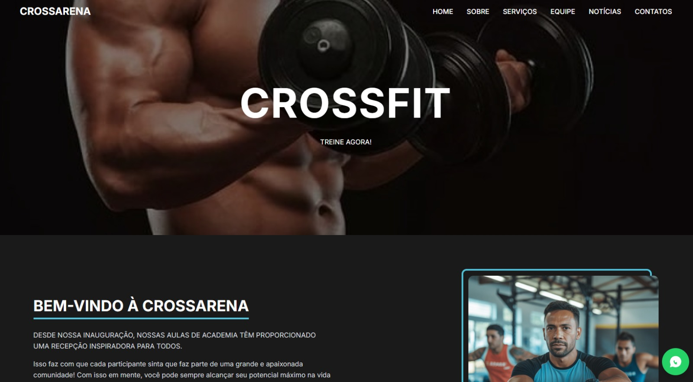

🏋️ CrossArena — CrossFit Studio Website

Projeto de página web institucional desenvolvido para uma academia fictícia de CrossFit, com foco em design moderno, responsividade e experiência do usuário.

Este projeto simula um site real de academia, apresentando programas de treino, identidade visual forte e integração direta com contato via WhatsApp.

🚀 Demonstração

💻 Interface moderna com foco em conversão de alunos
📱 Layout totalmente responsivo
⚡ Interface rápida utilizando Tailwind CSS

## 📸 Preview do Projeto



/assets/preview.png
🧠 Objetivo do Projeto

O objetivo deste projeto foi praticar e demonstrar habilidades em:

Estruturação semântica com HTML5

Estilização moderna com Tailwind CSS

Design responsivo (Mobile First)

Criação de landing pages institucionais

Organização visual focada em UX/UI

🛠️ Tecnologias Utilizadas

HTML5

Tailwind CSS

Google Fonts (Inter)

CSS Customizado

Responsividade com Flexbox e Grid

✨ Funcionalidades

✅ Header com navegação
✅ Hero Section com imagem de destaque
✅ Sessão institucional (Sobre)
✅ Cards de programas de treino
✅ Layout responsivo
✅ Botão flutuante do WhatsApp para contato direto
✅ Design moderno estilo fitness/gym

## 📂 Estrutura do Projeto

```
CrossArena/
│
├── index.html
├── instrutor.png
├── maratona.jpg
├── maratona2.jpg
├── treino_aberto.jpg
├── treino_livre.jpg
└── Como-mensurar-os-resultados-da-academia.jpg
```